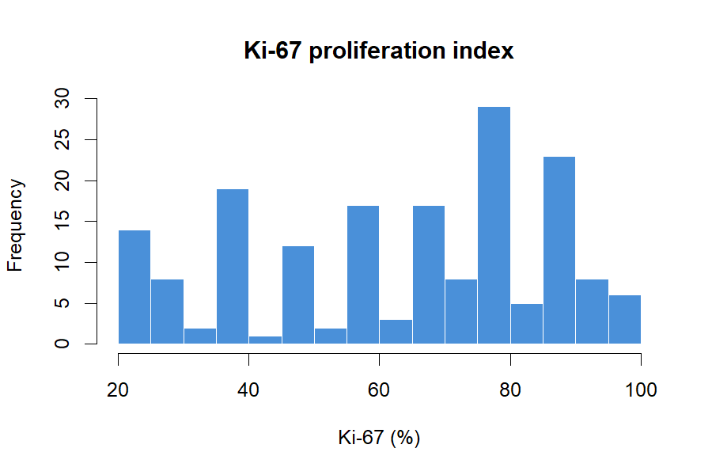
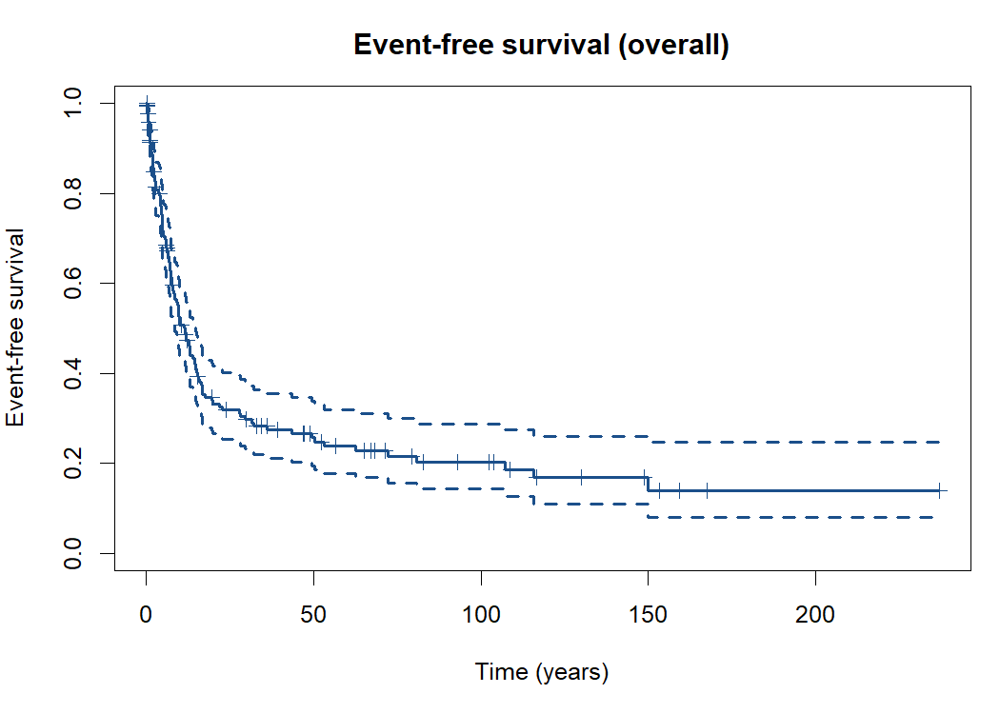
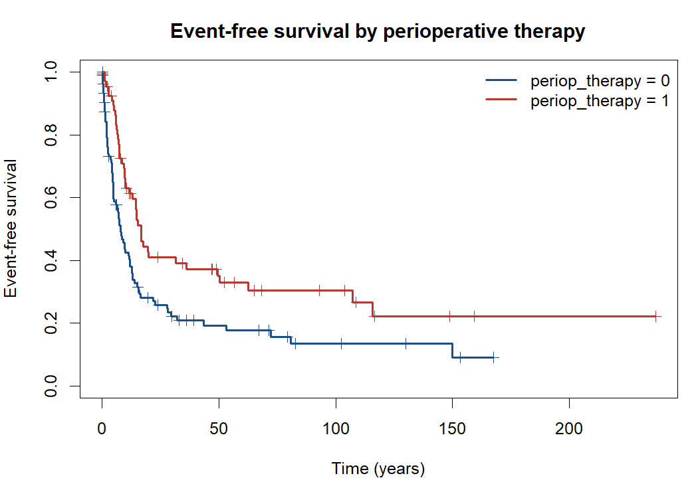
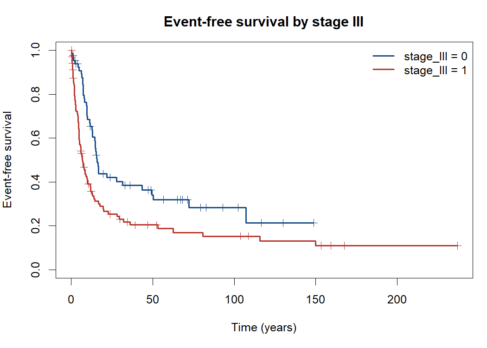
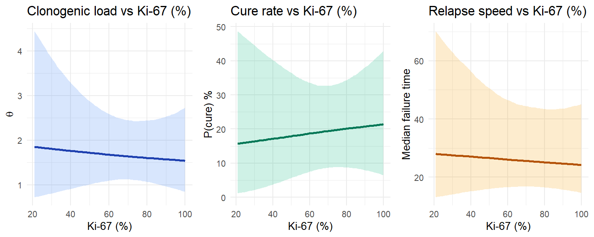
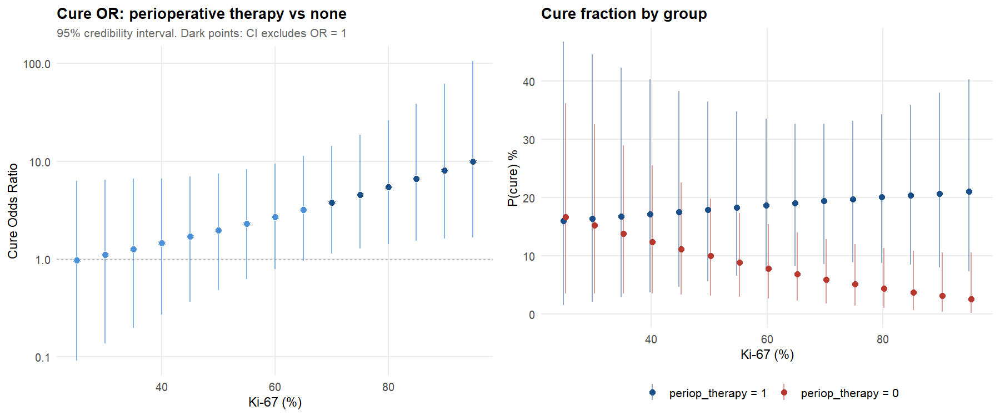
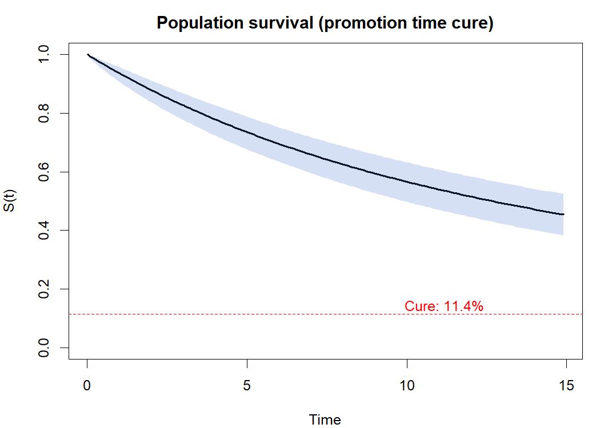

<!-- README.md is generated from README.Rmd. Please edit that file -->

<!-- Knit with: devtools::build_readme() or rmarkdown::render("README.Rmd") -->

<!-- Full knit takes ~10 min (Stan MCMC + censoring test). Output is cached. -->

# rgetne

<!-- badges: start -->

[](https://opensource.org/licenses/MIT)
[](https://southnecrgetne.shinyapps.io/rgetne/)
<!-- badges: end -->

**Bayesian Promotion Time Cure Model – Toolkit and Interactive App**

`rgetne` implements **Bayesian promotion-time cure models** (Yakovlev &
Tsodikov, bounded cumulative hazard formulation) via
[Stan](https://mc-stan.org/). It was developed as the reproducibility
companion for the paper *Perioperative Chemotherapy and Long-Term Cure
in Resected Grade 3 Gastroenteropancreatic Neuroendocrine Carcinomas:
The GETNE/SOUTH-NEC Study* by the GETNE (Spanish Group of Neuroendocrine
and Endocrine Tumors).

*(Manuscript under review – citation and DOI will be added upon
publication.)*

An interactive version of the app is available at
<https://southnecrgetne.shinyapps.io/rgetne/>.

------------------------------------------------------------------------

## Why a cure model?

In localised cancer after curative-intent surgery, conventional Cox
regression tells us *whether* a treatment improves survival but not
*how*. The hazard ratio cannot distinguish between:

- **Delaying recurrence** in patients who will eventually relapse (a
  *kinetic* effect), and
- **Eradicating residual disease** so that a subset of patients is
  permanently cured (a *clonogenic* effect).

The **promotion-time cure model** separates these two mechanisms. It
models the unobservable number of residual tumour cell clusters
(clonogenic foci) and the time each takes to produce a detectable
recurrence:

``` math
S(t \mid \mathbf{x}, \mathbf{z}) = \exp\bigl\{-\theta(\mathbf{x})\,\bigl[1 - S_0(t \mid \mathbf{z})\bigr]\bigr\}
```

| Component | Meaning | What covariates tell us |
|----|----|----|
| **Clonogenic** $`\theta(\mathbf{x})`$ | Expected residual tumour burden | Which factors increase or decrease the probability of being *cured* |
| **Kinetic** $`S_0(t \mid \mathbf{z})`$ | Weibull latency (speed of recurrence) | Which factors accelerate or delay relapse among *uncured* patients |

The cure probability is simply $`P(\text{cure}) = e^{-\theta}`$: the
fewer residual foci, the higher the chance that none remains viable.

This package provides:

- Full Bayesian estimation via HMC-NUTS (Stan)
- Support for **interactions** (e.g. Ki-67 x treatment) and
  **per-variable priors**
- **Kaplan-Meier** plots with optional stratification
- **Descriptive data summaries** and variable distributions
- **Identifiability diagnostics**: posterior cross-correlation,
  incremental censoring sensitivity
- **Clinical plots**: cure probability vs continuous covariates, cure
  odds ratios, population survival curves
- **Leave-one-out cross-validation** (LOO-IC)
- An **interactive Shiny application** for point-and-click exploration

------------------------------------------------------------------------

## Installation

``` r
# install.packages("remotes")
remotes::install_github("albertocarm/rgetne")
```

**Requirements:** R \>= 4.1, a working C++ toolchain (for Stan), and the
dependencies declared in DESCRIPTION (`rstan` \>= 2.26, `shiny`,
`bslib`, `survival`, `loo`, `bayesplot`, `ggplot2`, `gridExtra`).

------------------------------------------------------------------------

## Quick start: interactive app

``` r
library(rgetne)
cure()
```

This launches the Shiny application in your browser. The app auto-loads
a bundled example dataset (stage I–III GEP-NEC from the GETNE registry),
lets you select covariates, add interactions, run the Stan sampler, and
browse all results.

------------------------------------------------------------------------

## Full worked example

### 1. Load and preprocess data

``` r
library(rgetne)

dat <- prep_data(readRDS(example_data()))
cat(sprintf("n = %d patients, %d events (%.0f%%)\n",
            nrow(dat), sum(dat$.status_bin),
            100 * mean(dat$.status_bin)))
#> n = 174 patients, 124 events (71%)
```

### 2. Descriptive statistics

``` r
data_summary_table(dat)
#>               variable         stat               value
#> 1             EFS_time    mean (SD)         25.7 (40.1)
#> 2             EFS_time median [IQR]   9.3 [4.0 -- 26.9]
#> 3          .status_bin    n (%) = 1         124 (71.3%)
#> 4  primary_surgery_yes    n (%) = 1         139 (79.9%)
#> 5             stage_II    n (%) = 1          49 (28.2%)
#> 6            stage_III    n (%) = 1         107 (61.5%)
#> 7      site_colorectal    n (%) = 1          72 (41.4%)
#> 8        site_pancreas    n (%) = 1          40 (23.0%)
#> 9         ki67_percent    mean (SD)         64.6 (22.9)
#> 10        ki67_percent median [IQR] 70.0 [46.2 -- 80.0]
#> 11      periop_therapy    n (%) = 1          67 (38.5%)
```

### 3. Ki-67 distribution

``` r
hist(dat$ki67_percent, breaks = 20,
     col = "#4A90D9", border = "white",
     main = "Ki-67 proliferation index",
     xlab = "Ki-67 (%)", ylab = "Frequency")
```



### 4. Kaplan-Meier curves

`plot_km()` draws shaded 95% confidence bands, censoring tick marks, an
at-risk table beneath the curves and a log-rank `p`-value when
stratified. Stratification by binary, factor or character columns with
any number of levels is supported.

``` r
plot_km(dat, title = "Event-free survival (overall)")
```



``` r
plot_km(dat,
        strata        = "periop_therapy",
        strata_labels = c("periop_therapy = 0" = "No periop. chemotherapy",
                          "periop_therapy = 1" = "Periop. chemotherapy"),
        title         = "Event-free survival by perioperative therapy")
```



``` r
plot_km(dat,
        strata        = "stage_III",
        strata_labels = c("stage_III = 0" = "Stage I-II",
                          "stage_III = 1" = "Stage III"),
        title         = "Event-free survival by stage III")
```



``` r
# Stratify by tumour location (factor, multiple levels). Uses the original
# primary_site factor before it is collapsed into 0/1 dummies by prep_data().
raw <- readRDS(example_data())
dat_site <- prep_data(raw)
dat_site$primary_site <- factor(raw$primary_site[match(rownames(dat_site),
                                                       rownames(raw))])
plot_km(dat_site,
        strata = "primary_site",
        title  = "Event-free survival by primary tumour location")
```


### 5. Define and fit the cure model

``` r
mod <- cure_model(
  dat,
  clonogenic = ~ primary_surgery_yes + stage_II + stage_III +
                 site_colorectal + ki67_percent * periop_therapy,
  kinetic    = ~ ki67_percent + periop_therapy,
  prior_clonogenic = 2.5,
  prior_kinetic    = 0.25,
  prior_intercept  = 2.5
)

cfit <- fit_model(mod, chains = 4, iter = 4000, warmup = 1000,
                  adapt_delta = 0.95)
```

### 6. MCMC diagnostics

``` r
mcmc_checks(cfit)
#> 
#> === MCMC CONVERGENCE SUMMARY ===
#> Target: R-hat < 1.01 and n_eff > 400 for every monitored parameter.
#> 
#>            mean se_mean    sd   2.5%    50%  97.5%     n_eff  Rhat
#> beta0     0.778   0.001 0.134  0.525  0.775  1.054  8980.988 1.000
#> beta[1]  -0.163   0.001 0.099 -0.351 -0.163  0.037 13443.668 1.000
#> beta[2]   0.303   0.002 0.178 -0.026  0.296  0.670  8387.565 1.000
#> beta[3]   0.574   0.002 0.179  0.246  0.566  0.950  8487.249 1.000
#> beta[4]  -0.309   0.001 0.101 -0.510 -0.308 -0.112 12021.464 1.000
#> beta[5]   0.230   0.002 0.144 -0.056  0.231  0.511  8736.245 1.000
#> beta[6]   0.155   0.003 0.317 -0.478  0.156  0.759  8782.394 1.000
#> beta[7]  -0.451   0.004 0.321 -1.079 -0.448  0.177  8386.465 1.000
#> gamma0    3.505   0.002 0.186  3.183  3.491  3.915  7214.223 1.001
#> gamma[1] -0.044   0.001 0.143 -0.334 -0.040  0.228 10011.647 1.000
#> gamma[2]  0.108   0.001 0.141 -0.170  0.105  0.386 12896.776 1.000
#> alpha     0.997   0.001 0.066  0.867  0.997  1.127 11431.589 1.000
#> 
#> -- R-hat check --
#> OK: all R-hat <= 1.01 (chains have mixed).
#> 
#> -- Effective sample size check --
#> OK: all n_eff >= 400.
#> 
#> -- Sampler diagnostics --
#> 0 of 12000 iterations ended with a divergence.
#> 0 of 12000 iterations saturated the maximum tree depth of 12.
```

### 7. Coefficient summary

``` r
summary_coefs(cfit)
#> 
#> ===================================================================
#>   COEFFICIENTS (original scale)
#> ===================================================================
#> 
#> --- CLONOGENIC (incidence, log-theta) ---
#>     positive = more clonogenic cells = LOWER cure rate
#> 
#>   primary_surgery_yes                          : -0.406 [-0.873,  0.091]
#>   stage_II                                     :  0.657 [-0.059,  1.485]
#>   stage_III                                    :  1.161 [ 0.505,  1.946] *+
#>   site_colorectal                              : -0.624 [-1.033, -0.227] *-
#>   ki67_percent                                 :  0.010 [-0.002,  0.022]
#>   periop_therapy                               :  0.320 [-0.980,  1.556]
#>   ki67_percent:periop_therapy                  : -0.012 [-0.029,  0.005]
#> 
#> --- KINETIC (latency, log-lambda Weibull) ---
#>     negative = FASTER relapse
#> 
#>   ki67_percent                                 : -0.002 [-0.015,  0.010]
#>   periop_therapy                               :  0.216 [-0.348,  0.791]
#> 
#>   alpha (Weibull shape)                        :  0.997 [ 0.867,  1.127]
#> 
#>   Cure fraction (covariates at mean): 11.4% [5.7%, 18.4%]
```

### 8. Leave-one-out cross-validation

``` r
loo_fit(cfit)
#> 
#> Computed from 12000 by 174 log-likelihood matrix.
#> 
#>          Estimate   SE
#> elpd_loo   -510.9 24.9
#> p_loo        13.1  2.1
#> looic      1021.8 49.7
#> ------
#> MCSE of elpd_loo is 0.1.
#> MCSE and ESS estimates assume independent draws (r_eff=1).
#> 
#> All Pareto k estimates are good (k < 0.7).
#> See help('pareto-k-diagnostic') for details.
```

### 9. Identifiability diagnostics

``` r
test_correlation(cfit)
#> 
#> === TEST: Posterior cross-correlation (clonogenic vs kinetic) ===
#>     |r| > 0.6 = caution | |r| > 0.8 = severe
#> 
#>                             Intercept (lambda) ki67_percent periop_therapy
#> Intercept (theta)                        0.678       -0.155         -0.025
#> primary_surgery_yes                     -0.059       -0.051         -0.100
#> stage_II                                 0.049       -0.006          0.048
#> stage_III                                0.027       -0.082          0.083
#> site_colorectal                         -0.058        0.069          0.111
#> ki67_percent                            -0.198        1.000          0.369
#> periop_therapy                          -0.057        0.369          1.000
#> ki67_percent:periop_therapy              0.063       -0.467         -0.921
#>                              alpha
#> Intercept (theta)           -0.031
#> primary_surgery_yes         -0.088
#> stage_II                     0.031
#> stage_III                    0.071
#> site_colorectal             -0.051
#> ki67_percent                 0.104
#> periop_therapy               0.049
#> ki67_percent:periop_therapy -0.068
#> 
#> --- Shared variables ---
#>   ki67_percent (clono vs kinet): r = 0.624
#>   periop_therapy (clono vs kinet): r = 0.264
#> 
#> !! PAIRS WITH |r| > 0.6:
#>    Intercept (theta) <-> Intercept (lambda) : r = 0.678
#>    ki67_percent <-> ki67_percent : r = 1.000 *** SEVERE ***
#>    periop_therapy <-> periop_therapy : r = 1.000 *** SEVERE ***
#>    ki67_percent:periop_therapy <-> periop_therapy : r = -0.921 *** SEVERE ***
#> 
#> Max |cross-r|: 1.000 -> SEVERE
```

``` r
test_censoring(cfit, chains = 2, iter = 1000)
```

### 10. Contrasts (interactions supported)

``` r
cure_contrast(cfit, "clonogenic",
              var    = "periop_therapy",
              levels = list(periop_therapy = 1),
              ref    = list(periop_therapy = 0),
              at     = list(ki67_percent = c(30, 50, 70, 90)))
#> 
#> === CONTRAST: periop_therapy (clonogenic component) ===
#>   periop_therapy=1 vs periop_therapy=0
#>   Evaluated at levels of: ki67_percent
#> 
#>                   delta             95% CI   exp(d)             95% CI   P(d>0)   P(d<0)
#>    ------------------------------------------------------------------------------------------ 
#>   ki67_percent=30   -0.046 [-0.883,  0.761]   0.955 [0.414, 2.141]  0.456     0.544
#>   ki67_percent=50   -0.295 [-0.886,  0.286]   0.745 [0.412, 1.332]  0.159     0.841
#>   ki67_percent=70   -0.544 [-1.034, -0.050]   0.581 [0.355, 0.951]  0.015     0.985
#>   ki67_percent=90   -0.790 [-1.397, -0.185]   0.454 [0.247, 0.831]  0.006     0.994
```

### 11. Clinical plots

``` r
plot_continuous_effect(cfit, x_var = "ki67_percent",
                       fix  = list(periop_therapy = 1),
                       xlab = "Ki-67 (%)")
```



``` r
plot_contrast_cure_or(
  cfit,
  var    = "periop_therapy",
  levels = list(periop_therapy = 1),
  ref    = list(periop_therapy = 0),
  at_var = "ki67_percent",
  at_seq = seq(25, 95, by = 5),
  xlab   = "Ki-67 (%)",
  title  = "Cure OR: perioperative therapy vs none")
```



    #> 
    #> === Cure OR summary ===
    #>   ki67_percent       OR             95% CI  P(OR>1)  Cure(trt)  Cure(ref)
    #>    ---------------------------------------------------------------------- 
    #>   25.0         0.97 [ 0.09,  6.34]    0.487      16.0%      16.7%
    #>   30.0         1.10 [ 0.14,  6.48]    0.544      16.4%      15.2%
    #>   35.0         1.27 [ 0.20,  6.61]    0.612      16.8%      13.8%
    #>   40.0         1.47 [ 0.27,  6.66]    0.686      17.2%      12.4%
    #>   45.0         1.70 [ 0.36,  6.98]    0.766      17.5%      11.2%
    #>   50.0         1.98 [ 0.48,  7.44]    0.841      17.9%      10.0%
    #>   55.0         2.31 [ 0.62,  8.25]    0.902      18.3%       8.9%
    #>   60.0         2.71 [ 0.79,  9.48]    0.944      18.7%       7.8%
    #>   65.0         3.20 [ 0.96, 11.32]    0.971      19.0%       6.8%
    #>   70.0         3.80 [ 1.14, 14.26]    0.985      19.4%       6.0%
    #>   75.0         4.56 [ 1.28, 18.70]    0.991      19.8%       5.1%
    #>   80.0         5.46 [ 1.42, 26.30]    0.994      20.1%       4.4%
    #>   85.0         6.64 [ 1.53, 38.85]    0.994      20.4%       3.7%
    #>   90.0         8.10 [ 1.63, 62.22]    0.994      20.7%       3.1%
    #>   95.0         9.96 [ 1.66, 105.94]    0.994      21.0%       2.6%

``` r
plot_surv_curve(cfit)
```



### 12. Pairwise interaction screen (Supplementary Table A5)

`screen_interactions()` fits the additive base model and one model per
supplied pair (base + a single interaction term), then reports the
posterior median and 95% credible interval of the interaction
coefficient on the original (un-standardised) covariate scale, the
probability of direction, and the LOO-CV ELPD difference relative to
the additive base model. Results are sorted by strength of evidence.

``` r
base_clono <- ~ ki67_percent + periop_therapy + primary_surgery_yes +
                 stage_III   + site_pancreas  + site_colorectal

a5 <- screen_interactions(
  data            = dat,
  base_clonogenic = base_clono,
  kinetic         = ~ ki67_percent + periop_therapy,
  pairs = list(
    c("ki67_percent",        "periop_therapy"),
    c("ki67_percent",        "primary_surgery_yes"),
    c("ki67_percent",        "site_pancreas"),
    c("periop_therapy",      "site_pancreas"),
    c("primary_surgery_yes", "stage_III"),
    c("primary_surgery_yes", "site_colorectal"),
    c("periop_therapy",      "primary_surgery_yes"),
    c("periop_therapy",      "stage_III"),
    c("stage_III",           "site_pancreas"),
    c("primary_surgery_yes", "site_pancreas")
  ),
  labels = c(
    "ki67_percent:periop_therapy"         = "Ki-67 \u00d7 Periop. chemotherapy",
    "ki67_percent:primary_surgery_yes"    = "Ki-67 \u00d7 Primary surgery",
    "ki67_percent:site_pancreas"          = "Ki-67 \u00d7 Pancreatic site",
    "periop_therapy:site_pancreas"        = "Periop. chemo \u00d7 Pancreatic site",
    "primary_surgery_yes:stage_III"       = "Primary surgery \u00d7 Stage III",
    "primary_surgery_yes:site_colorectal" = "Primary surgery \u00d7 Other site",
    "periop_therapy:primary_surgery_yes"  = "Periop. chemo \u00d7 Primary surgery",
    "periop_therapy:stage_III"            = "Periop. chemo \u00d7 Stage III",
    "stage_III:site_pancreas"             = "Stage III \u00d7 Pancreatic site",
    "primary_surgery_yes:site_pancreas"   = "Primary surgery \u00d7 Pancreatic site"
  ),
  chains = 4, iter = 4000, warmup = 1000
)

knitr::kable(format_interaction_table(a5), align = "lrlrrl",
             caption = "Supplementary Table A5. Pairwise interaction screen.")
```

The full screen yields the table below. Each interaction was fitted as
a separate model and compared against the additive main-effects model
via LOO-CV.

| Interaction term                       | Coefficient | 95% CrI         | P(direction) | ΔELPD | Evidence       |
|----------------------------------------|------------:|:----------------|-------------:|------:|:---------------|
| Ki-67 × Periop. chemotherapy           |      −0.014 | −0.031, 0.005   |        93.5% |  −0.4 | Suggestive **  |
| Ki-67 × Primary surgery                |      −0.011 | −0.032, 0.009   |        87.4% |  −0.5 | Suggestive *   |
| Ki-67 × Pancreatic site                |       0.010 | −0.011, 0.032   |        84.2% |  −1.5 | Suggestive *   |
| Periop. chemo × Pancreatic site        |       0.576 | −0.40, 1.61     |        86.8% |  −0.7 | Suggestive *   |
| Primary surgery × Stage III            |      −1.772 | −5.24, 0.81     |        90.0% |  −0.4 | Suggestive **  |
| Primary surgery × Other site           |      −1.051 | −2.92, 0.40     |        91.8% |  −1.6 | Suggestive **  |
| Periop. chemo × Primary surgery        |      −0.383 | −1.40, 0.80     |        74.1% |  −0.8 | Weak           |
| Periop. chemo × Stage III              |       0.016 | −1.57, 1.90     |        51.0% |  −2.2 | None           |
| Stage III × Pancreatic site            |       0.158 | −1.60, 2.22     |        56.4% |  −2.6 | None           |
| Primary surgery × Pancreatic site      |      −0.456 | −2.36, 1.06     |        70.6% |  −1.6 | Weak           |

Interaction coefficients are reported on the original (unscaled)
covariate scale. For continuous × binary interactions (e.g.,
Ki-67 × chemotherapy) the coefficient represents the change in the
slope of the continuous variable when the binary variable is switched
on; for binary × binary interactions it represents the departure from
additivity on the log-θ scale. `P(direction)` is the posterior
probability that the interaction coefficient has the sign of its median
(`** pd > 90%`, `* pd > 80%`). ΔELPD is the difference in expected log
pointwise predictive density relative to the additive base model:
negative values favour the interaction model and a difference exceeding
twice its standard error is considered meaningful.

**Comment on the interactions.** No interaction model meaningfully
improved predictive performance over the additive specification —
every ΔELPD is negative (favouring the simpler additive model) and well
within `2 × SE`. The strongest signal, *Ki-67 × peri-operative
chemotherapy* (`pd = 93.5%`), is a negative interaction on the
log-θ scale: the slope of Ki-67 in the clonogenic linear predictor
becomes more negative when chemotherapy is given, i.e. the cure benefit
of chemotherapy grows with proliferation index. Conditional contrasts
showed that chemotherapy had no detectable effect at Ki-67 ≤ 30%
(clonogenic ratio 0.98; CrI 0.40–2.13) but progressively reduced
clonogenic burden at higher values (Ki-67 = 70%: ratio 0.56,
CrI 0.33–0.92; Ki-67 = 90%: ratio 0.43, CrI 0.23–0.79), corresponding
to cure odds ratios of 4.2 and 10.6. *Primary surgery × Other site* and
*Primary surgery × Stage III* sit at `pd ≈ 90%` but with very wide
intervals straddling zero, so they should be read as exploratory hints
that the surgical effect is not perfectly homogeneous across sites and
stages rather than as confirmed effect modifiers. The remaining seven
pairs show no meaningful evidence of departure from additivity.

CrI = credible interval; ELPD = expected log pointwise predictive
density; LOO-CV = leave-one-out cross-validation; pd = probability of
direction; θ = expected clonogenic burden.

------------------------------------------------------------------------

## Data requirements

`prep_data()` transforms raw registry data into the model-ready format:

| Raw column | Transformed | Description |
|----|----|----|
| `time_efs` | `EFS_time` | Event-free survival time (years) |
| `event_status` | `.status_bin` | 1 = event, 0 = censored |
| `primary_surgery` (Yes/No) | `primary_surgery_yes` | Primary surgery performed |
| `disease_stage` (I/II/III) | `stage_II`, `stage_III` | Disease stage dummies (ref: stage I) |
| `primary_site` (Colorectal/Other/Pancreas) | `site_colorectal`, `site_pancreas` | Primary site dummies (ref: Other) |
| `ki67_percent` | `ki67_percent` | Ki-67 proliferation index (0–100) |
| `periop_therapy` (0/1) | `periop_therapy` | Received perioperative chemotherapy |

You can upload your own `.rds` file through the Shiny app’s Data panel,
provided it contains these columns (or their pre-transformed
equivalents).

------------------------------------------------------------------------

## Package functions

| Function | Description |
|----|----|
| `cure()` / `cure_app()` | Launch the interactive Shiny application |
| `prep_data()` | Preprocess raw data for modelling |
| `cure_model()` | Define model specification (formulas + priors) |
| `fit_model()` | Fit the model via Stan HMC-NUTS |
| `mcmc_checks()` | MCMC convergence diagnostics (R-hat, ESS, divergences) |
| `summary_coefs()` | Posterior coefficient summary on the original scale |
| `loo_fit()` | Leave-one-out cross-validation |
| `cure_contrast()` | Compute scenario contrasts with credible intervals |
| `screen_interactions()` / `format_interaction_table()` | Pairwise interaction screen + Supplementary Table A5 |
| `test_correlation()` | Posterior cross-correlation between sub-models |
| `test_censoring()` | Incremental censoring sensitivity test |
| `plot_km()` | Kaplan-Meier survival curves (multi-level strata, CI bands, at-risk table, log-rank `p`) |
| `plot_continuous_effect()` | Triptych: clonogenic load, cure rate, median failure time |
| `plot_contrast_cure_or()` | Cure odds ratio across a continuous modifier |
| `plot_surv_curve()` | Population survival curve from the cure model |
| `data_summary_table()` | Descriptive statistics table |
| `example_data()` / `stan_model_file()` | Paths to bundled assets |

------------------------------------------------------------------------

## Citation

> *Manuscript under review.* Full citation and DOI will be added upon
> publication.

> rgetne: Bayesian Promotion Time Cure Model Toolkit (R package).
> <https://github.com/albertocarm/rgetne>

------------------------------------------------------------------------

## License

MIT. See [LICENSE](LICENSE).
